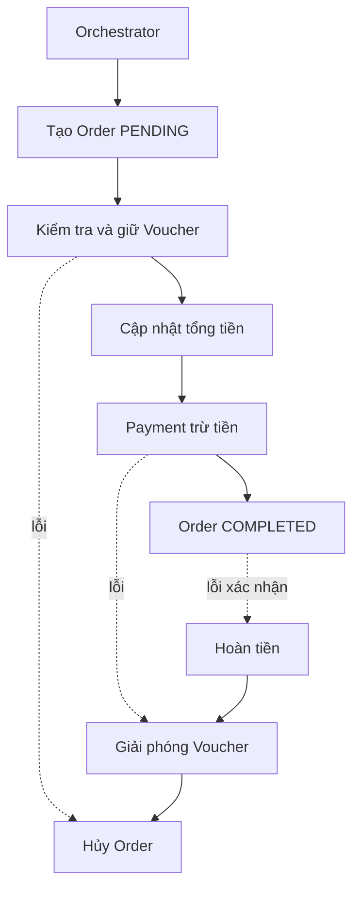

# SS14 HW04 - Choreography và Orchestration

**Sinh viên:** Trương Hà Cẩm Linh

**Lớp:** IT214

**Mã sinh viên:** PTIT056

## Tích hợp Voucher

Quy trình cần kiểm tra mã voucher, điều kiện sử dụng, giữ lượt dùng, tính số tiền giảm, cập nhật tổng tiền đơn hàng rồi mới thanh toán. Nếu bước sau thất bại, hệ thống phải giải phóng voucher và hủy đơn; nếu đã thanh toán thì phải hoàn tiền.

## Hai giải pháp

### Choreography

`Voucher Service` nghe `OrderCreated`, phát `VoucherApplied`; Order cập nhật tiền rồi phát event cho Payment. Các service tự phản ứng với event, không có trung tâm điều khiển.

### Orchestration

Orchestrator gọi tuần tự Order, Voucher và Payment. Nó nắm trạng thái luồng và gọi compensate khi xảy ra lỗi.

## So sánh

| Tiêu chí | Choreography | Orchestration |
|---|---|---|
| Thêm service mới | Dễ lúc đầu, nhưng tăng nhiều event và quan hệ ngầm | Thêm bước rõ trong workflow, orchestrator lớn dần |
| Giám sát | Khó ghép trace từ nhiều topic | Dễ xem trạng thái tại một nơi |
| Độ trễ | Bất đồng bộ, ít chờ tuần tự | Thường cao hơn do gọi tuần tự |
| Mở rộng | Service và consumer scale độc lập | Orchestrator cần scale và tránh thành nút nghẽn |
| Bảo trì | Khó khi event graph phức tạp | Luồng dễ đọc, nhưng phụ thuộc bộ điều phối |
| Xử lý lỗi | Mỗi service tự biết event bù trừ | Orchestrator quyết định compensate tập trung |

## Giải pháp lựa chọn

Bài chọn **Orchestration** vì hệ thống đã có Voucher, Loyalty và Notification, khiến event graph khó debug. Checkout Orchestrator giúp nhìn rõ thứ tự và chính sách bù trừ.



## Source demo

- `checkout-orchestrator`: port 8080.
- `order-service`: port 8081.
- `voucher-service`: port 8082, voucher hợp lệ là `SAVE10`.
- `payment-service`: port 8083, từ chối số tiền trên 5.000.000.

Chạy:

```bash
./gradlew :order-service:bootRun
./gradlew :voucher-service:bootRun
./gradlew :payment-service:bootRun
./gradlew :checkout-orchestrator:bootRun
```

Kiểm thử thành công:

```bash
curl -X POST http://localhost:8080/api/checkout \
  -H 'Content-Type: application/json' \
  -d '{"customerId":"CUS-01","voucherCode":"SAVE10","originalAmount":1000000}'
```

Đổi voucher thành `SAI-MA` để kiểm tra Order bị hủy. Đặt số tiền trên 5.555.556 để sau giảm giá vẫn vượt 5.000.000 và kiểm tra giải phóng voucher, hủy Order.

## Build

```bash
./gradlew clean build
```

Báo cáo PDF nằm trong `output/pdf/`.
